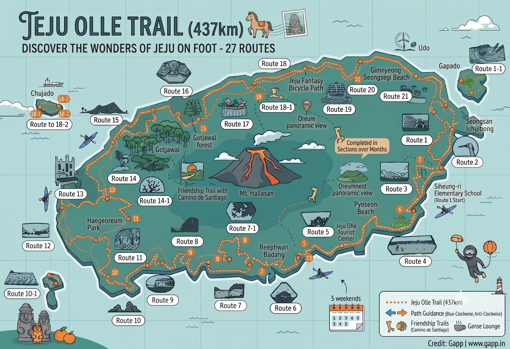

The Jeju Olle Trail is a network of waymarked walking routes that wraps around the entire coast of Jeju Island, dips into the interior, and crosses out to several offshore islands. It was founded in 2007 by former journalist Suh Myung-sook after she walked the Camino de Santiago in Spain and decided Jeju deserved its own slow-walking pilgrimage. The Olle Foundation has been adding routes ever since.

The name "olle" comes from the Jeju dialect — it refers to the narrow alley that connects the front door of a traditional Jeju house to the main road. Each route is meant to feel like one long olle: an intimate path between you and the island.

## The numbers

- **27 routes in total** — 21 main numbered routes (1 to 21, with a small gap) plus 6 sub-routes (numbered 1-1, 7-1, 10-1, 14-1, 18-1, 21-1) and a short spur to Jeju International Airport.
- **437 km total distance.**
- **Average route length: ~16 km** (range roughly 8–22 km per route).
- **Three stamps per route** at the start, midpoint, and end. To officially finish the trail you need to collect all stamps from all 27 routes.

## How the trail is marked

You navigate using three visual cues, in order of confidence:

1. **The Ganse (간세)** — a small wooden pony-shaped marker, painted blue, that sits at junctions and points its head in the forward (clockwise) direction. *Ganse-dari* in Jeju dialect means "slow idler," which is the spirit the foundation is trying to keep alive.
2. **Blue and orange ribbons** tied to trees, poles, walls, and fences. Blue ribbons mark the **forward / clockwise** direction. Orange ribbons mark the **reverse / counter-clockwise** direction. If you are walking in numerical order from Route 1 onward, follow the blue.
3. **Painted arrows on the ground** at intersections where ribbons alone are ambiguous.

If you have not seen any of these three markers for ~5 minutes, you are off-trail. Backtrack to the last one.

## The Olle Passport

The official **paper passport** is a small spiral-bound booklet sold at the Olle Foundation tourist centres (the main one is at the Route 1 starting point in Siheung-ri, and there's another at the Foundation office in Seogwipo). It costs **₩20,000** as of recent years. Each route has a dedicated page with a map, route description, and three blank circles for the start / mid / end stamps.

The stamps live inside the Ganse-shaped wooden stamp boxes. Each route's stamp is unique — different shape, different symbol. You press it into the passport yourself. The ink fades over time if you don't close the cover quickly, so blot the page or let it dry for ~10 seconds before flipping.

### The completion certificate and medal

When you have collected **all three stamps for all 27 routes** (81 stamps in total), you can submit your passport at the Olle Foundation HQ in Seogwipo. The Foundation will issue you:

- An official **Certificate of Completion**, with your name and finish date.
- A **commemorative medal** with the Ganse motif.
- Your name added to the official finisher list, which is published periodically.

If you lose a passport mid-journey you cannot easily reconstruct it — buy a second passport and re-collect the missing stamps, or contact the Foundation in advance about transferring stamps.

## Route highlights worth planning around

Not all 27 routes are equal. A few are widely considered the standouts:

- **Route 1 (Siheung → Gwangchigi, ~15 km)** — the original Olle route, gentle east-coast farmland and seaside walking. Start here for ceremonial reasons.
- **Route 7 (Oedolgae → Wolpyeong, ~17.6 km)** — usually voted the most scenic route. South coast cliffs, Oedolgae rock pillar, lush coastal forest.
- **Route 10 (Hwasun → Moseulpo, ~17.5 km)** — Sanbangsan, Hyeongjeseom view, Songaksan parasitic cone.
- **Route 1-1 (Udo Island loop, ~11.3 km)** — short ferry from Seongsan, then a walk around a tiny island that looks like a reclining cow.
- **Route 10-1 (Gapado Island loop, ~5 km)** — Korea's southernmost inhabited island, all barley fields and stone walls. Ferry from Moseulpo.
- **Route 14-1 (Inland, ~16.7 km)** — a forest route that climbs Geumak Mountain and cuts through Jeotji Oreum. The mood is completely different from the coastal routes.

## Difficulty ratings

The Foundation grades each route on a four-tier scale:

- 🌶 **Easy** — flat coastal walking, ~4–5 hours
- 🌶🌶 **Moderate** — rolling, occasional oreum climbs, ~5–6 hours
- 🌶🌶🌶 **Hard** — significant oreum or mountain climbing, ~6–7 hours
- 🌶🌶🌶🌶 **Very hard** — long, exposed, or technical (rare; only a handful of routes)

Most routes are 🌶🌶. Routes 8, 14, and 14-1 are often called out as harder.

## Timing strategies

### Pure walking pace (4 km/h on average, including stamp stops)

- 1 route = 4–6 hours per day.
- 2 routes/weekend × ~14 weekends ≈ 28 walking days.
- Realistic calendar: **6 to 10 months** with seasonal breaks.

### Run/walk hybrid (ultra-runner pace, 6:00–7:00 min/km on rolling terrain)

- 1 route = 1.5–2 hours.
- 3 routes/day = ~50 km of running.
- 2 days per weekend × ~5 weekends ≈ 9–10 running days.
- The bottleneck stops being legs; it becomes the stamp boxes themselves (must physically press all three) and the willingness of guesthouses to feed and house you at trailhead villages.

### Long-holiday compression

A Chuseok or Seollal block of 4–5 days gives you 12–15 routes in one shot if you are running. See [[Jeju Trifecta]] for a sample 5-day mixed-modal itinerary.

## Seasonal notes

- **Spring (Mar–May)** — canola flowers bloom yellow along the east coast routes. Cool, dry, ideal.
- **Summer (Jun–Aug)** — hot, humid, monsoon rain in late June through July. Avoid the inland Route 14-1 and the south-coast climbs midday. Mosquitoes in the lava forest sections.
- **Autumn (Sep–Nov)** — typically the best window. Clear skies, mild temps, fewer tourists.
- **Winter (Dec–Feb)** — windy, occasionally snowy on the inland routes. The Mt. Halla foothill sections can be impassable after heavy snow. Coastal routes remain doable in fleece and a windshell.

## Accommodation

Olle hikers historically slept in **minbak (민박)** — local guesthouses where families rent out a room in their own home, often with breakfast and dinner included. Many minbak owners are themselves former Olle hikers or fishermen and can be incredibly hospitable.

Modern options now include:

- **Olle Foundation–recognised guesthouses** — listed on the official site, vetted, English-speaking owners are flagged.
- **Olle Stay** in Seogwipo (centrally located, gender-segregated dorms, big communal kitchen) — popular hub for runners doing south-coast routes.
- **Pension houses** — full apartment-style rentals, more suitable for groups.
- **Standard hotels** in Jeju City, Seogwipo, Hamdeok, Seongsan, Hyeopjae — fine for accessing nearby routes; book on Agoda, Naver, or Booking.

Naver Map and KakaoMap have the best coverage of minbak in remote trailhead villages — many of these don't appear on Google or international booking sites.

## Logistics integration

- Most trail terminals connect to **city buses** (run by Jeju Bus 제주버스 — use the BUSTAGO or Kakao Bus apps). Buses are infrequent on east-coast routes (1 every 30–60 min) but reliable.
- Taxis are cheap but the trailheads in remote villages often have no taxi rank — use the **Kakao T** app and accept a 5–15 min wait.
- **Luggage forwarding** — see [[Jeju Luggage Forwarding Services]]. With ZIM CARRY or similar, you can sleep in Hotel A, leave your suitcase at the front desk in the morning tagged for Hotel B, and finish your route 25–50 km away to find the bag already waiting at check-in.

## Official resources

- Jeju Olle Foundation English site: [jejuolletrailguide.net](https://jejuolletrailguide.net/)
- Jeju Olle Foundation Korean site: [jejuolle.org](https://jejuolle.org)
- Route map PDF: published annually; download the latest from the English guide site.
- WhatsApp / Kakao groups for hikers exist; the Foundation publishes contacts on its FAQ page.

## Related pages

- [[Jeju Trifecta]] — the overarching project.
- [[Jeju Fantasy Bike Path Challenge]] — the bike loop.
- [[Jeju Kayak Circumnavigation Challenge]] — the sea kayak loop.
- [[Jeju Luggage Forwarding Services]] — hotel-to-hotel courier logistics.
- [[Gimpo to Jeju Flight Hacks]] — getting there cheap.
