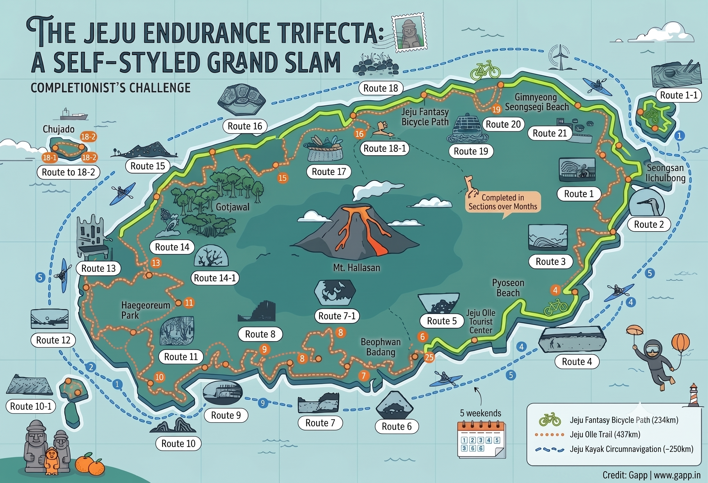

The Jeju Trifecta (sometimes called the Jeju Multi-Modal Grand Slam) is a self-styled completionist challenge that circumnavigates Jeju Island three times, once in each of three human-powered modalities:

1. [[Jeju Fantasy Bike Path Challenge]] — **234 km** coastal road loop with a 10-stamp K-Water passport.
2. [[Jeju Olle Trail Challenge]] — **437 km** across 27 numbered walking routes, each with a Ganse stamp.
3. [[Jeju Kayak Circumnavigation Challenge]] — **~253 km** of open-water sea kayaking along the coastline.

It is not an official organised event — there is no governing body, no entry fee, no medal. Finishing it means you have collected the bike-path passport, the Olle passport, and a GPS log of a paddled coastal loop. Once you finish all three, you will know the geometry, topography, marine currents, and wind patterns of that volcanic island better than almost anyone else alive.

## At-a-glance comparison

| Leg | Distance | Typical timeline | Required gear | Hardest part |
|---|---|---|---|---|
| Bike (Fantasy Path) | 234 km | 1 fast weekend (2 days) to 4 leisurely days | Road or gravel bike, K-Water passport | Logistics of getting the bike to Jeju |
| Walk/Run (Olle) | 437 km across 27 routes | 14–15 weekends walking; 4–5 weekends running | Trail shoes, Olle passport (₩20,000) | Volume; collecting all 81 stamps (3 per route) |
| Kayak | ~253 km | 5–6 weekends at 25 km/day; 5–7 continuous days at 40 km/day | Sea-capable kayak, PFD, spray skirt, paddle | Weather windows; south coast swell; wind |

## Recommended order

1. **Bike first (1 weekend).** Knock out the Fantasy Path early. It builds a macro-level mental map of the entire island infrastructure, the wind direction, the elevation, and the rest stops. Useful intelligence for the other two legs.
2. **Kayak second (late spring or early autumn).** Do the paddle when sea conditions are stable — typically May/June and September/October, outside the typhoon and monsoon windows. Five to six dedicated weekend trips at ~50 km per weekend (25 km/day) works well.
3. **Olle Trail last (year-round, anchored on cooler months).** Treat the Olle as the long zen project. Two routes per weekend if walking; up to six routes per weekend if running. Most weekend-warriors split it over 6 to 10 months.

## Multi-modal weekend / long-holiday strategy

The Korean calendar gives you two extended blocks each year — **Chuseok** in autumn and **Seollal** in winter — that stretch to 3–5 continuous days. These are gold for mixing modalities and giving each muscle group a recovery day. A sample 5-day Chuseok itinerary:

- Day 1: Run Olle Routes 1–3 (~50 km)
- Day 2: Kayak Seongsan → Seogwipo (~25 km) — paddle while your legs recover
- Day 3: Run Olle Routes 5–7 (~50 km)
- Day 4: Kayak Moseulpo → Aewol (~25 km)
- Day 5: Run the west coast back to Jeju City (~50 km)

You alternate the dominant muscle group every 24 hours, which is the only way to sustain that kind of daily volume.

## Supporting infrastructure (read these too)

- [[Gimpo to Jeju Flight Hacks]] — the air bridge that makes weekend trips trivially cheap.
- [[Jeju Luggage Forwarding Services]] — the courier networks that move your gear hotel-to-hotel so you never have to backtrack.
- [[Transporting a Bicycle to Jeju]] — bike rental on Jeju vs. shipping your own.
- [[Packable Sea Kayak Selection]] — choosing the right boat for the paddle leg.
- [[Importing a Kayak to Korea]] — customs, PCCC, and duty rates.
- [[Kayaking in Seoul and Incheon]] — training grounds before you launch in Jeju.

## What you walk away with

A completed Jeju Bike Path certificate (stamped passport plus your name added to the K-Water roster), a finished Olle passport with a commemorative medal from the Jeju Olle Foundation, and a Strava / GPS log of a ~253 km kayak loop. No one will ask. You will know.
